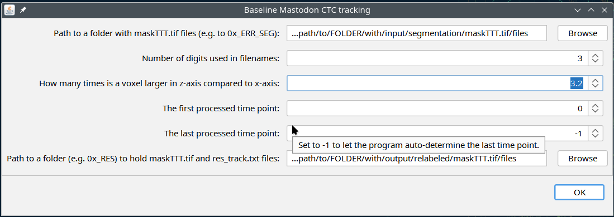
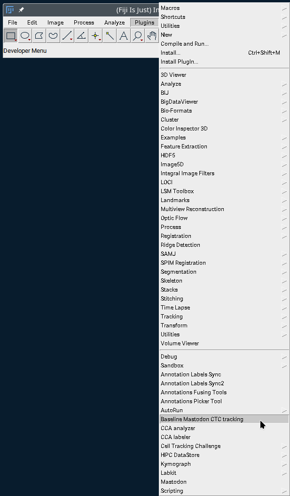

The CellTrackingChallenge Mastodon Baseline
-------------------------------------------
In order to link existing segmentation images, both 2D and 3D and stored according to the
[CellTrackingChallenge standard](https://celltrackingchallenge.net/datasets/), with
[Mastodon](https://mastodon.readthedocs.io/en/latest/) one can use the [Fiji](https://fiji.sc/)
plugin `Baseline Mastodon CTC tracking`.

Obtaining the plugin (into new or existing Fiji installation):
--------------------------------------------------------------
This plugin is freely available from Fiji update sites:

1. Open Fiji
1. Click menus: 'Help' -> 'Update...'
1. Click 'Manage update sites' in the opened 'ImageJ Updater' dialog
1. Mark the 'Mastodon' and 'CellTrackingChallenge' checkboxes
1. Click 'Apply and Close' to close the dialog
1. After Fiji restart, one can find the plugin in the Fiji menus:

About
-----
This is a repository with Java source codes of the Fiji tools related to
the Cell Tracking Challenge and to [Mastodon](https://github.com/mastodon-sc/mastodon).
The original source codes are available from [Mastodon github sites](https://github.com/mastodon-sc/mastodon-ctc/).

The tools were developed and the page is maintained by [Vladimír Ulman](http://www.fi.muni.cz/~xulman/).

Contact < **vladimir.ulman při vsb.cz** > for help on how to use it.

License
--------
The tools are licensed with the [BSD 2-Clause License](https://choosealicense.com/licenses/bsd-2-clause/).
