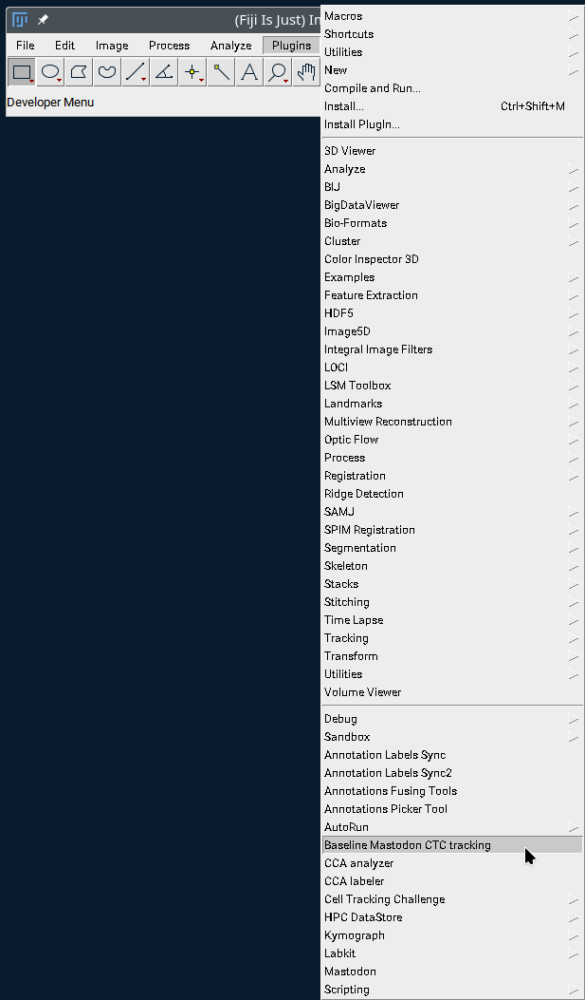

The CellTrackingChallenge Mastodon Baseline
-------------------------------------------
In order to link existing segmentation images, both 2D and 3D and stored according to the
[CellTrackingChallenge standard](https://celltrackingchallenge.net/datasets/), with
[Mastodon](https://mastodon.readthedocs.io/en/latest/) one can use the [Fiji](https://fiji.sc/)
plugin `Baseline Mastodon CTC tracking`.

Obtaining the plugin (into new or existing Fiji installation):
--------------------------------------------------------------
This plugin is freely available from Fiji update sites:

1. Open Fiji
1. Click menus: 'Help' -> 'Update...'
1. Click 'Manage update sites' in the opened 'ImageJ Updater' dialog
1. Mark the 'Mastodon' and 'CellTrackingChallenge' checkboxes
1. Click 'Apply and Close' to close the dialog
1. Click "Apply" to finish the Updater, and restart Fiji
1. After Fiji restart, one can find the plugin in the Fiji menus:

About
-----
This is a repository with Java source codes of the Fiji tools related to
the Cell Tracking Challenge and to [Mastodon](https://github.com/mastodon-sc/mastodon).
The original source codes are available from [Mastodon github sites](https://github.com/mastodon-sc/mastodon-ctc/).

The tools were developed and the page is maintained by [Vladimír Ulman](http://www.fi.muni.cz/~xulman/).

Contact < **vladimir.ulman při vsb.cz** > for help on how to use it.

License
--------
The tools are licensed with the [BSD 2-Clause License](https://choosealicense.com/licenses/bsd-2-clause/).

# Instance segmentation importers
## Generic segmentation-only importer
This importer was designed to extract spots from images showing instance segmentation,
and on-demand create links between segments (spots) that *overlap significantly*
in consecutive time points.

One can find the dialog in Mastodon -> Plugins -> Cell Tracking Challenge -> Import from instance segmentation:

## CTC-formatted segmentation and tracking importer
This importer was designed to extract spots from images with instance segmentation,
and create links between segments (spots) of the *same label*.

One can find the dialog in Mastodon -> File -> Import -> Import from CellTrackingChallenge:

There, one could choose a folder and format of the filenames in that folder:

...the `res_track.txt` file is an auxiliary file that informs which instance label
existed in what time points range and, especially, provides the parental relationship
information. If one holds only a segmentation and not also the tracking, it should
also suffice to provide an empty `res_track.txt` file.
But this is not a supported mode of operation.

